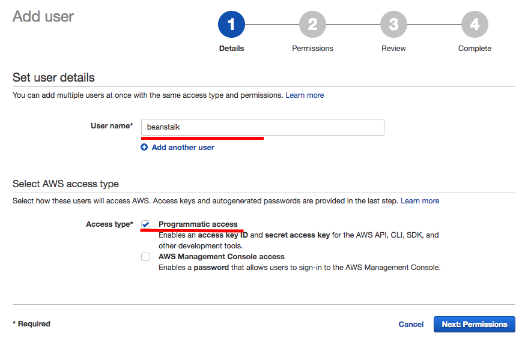
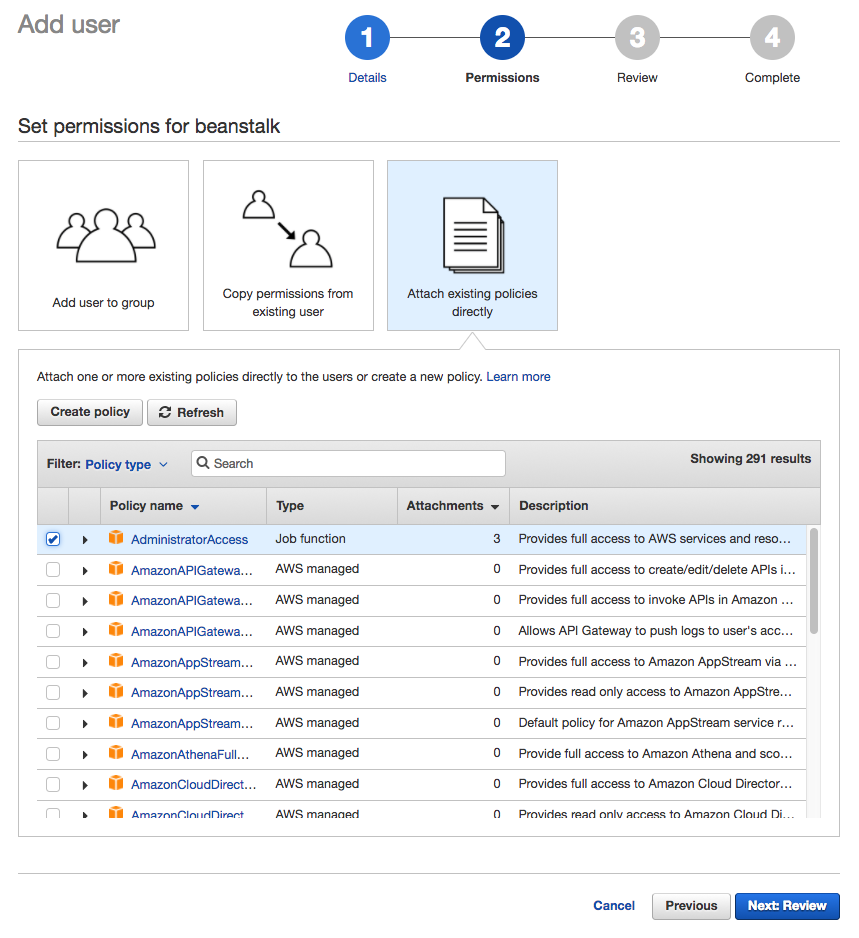
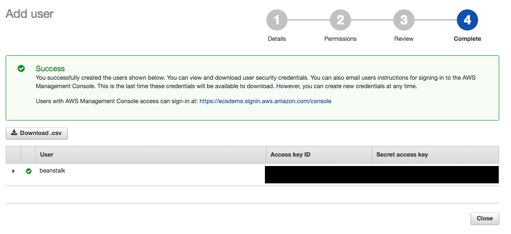

## Create an SSH Key

1. First, you'll need to select a region. For this lab, you will need to choose either Ohio or Oregon. At the top right hand corner of the AWS Console, you'll see a Support dropdown. To the left of that is the region selection dropdown.

2. Then you'll need to create an SSH key pair which will be used to login to the instances once provisioned. Go to the EC2 Dashboard and click on Key Pairs in the left menu under Network & Security. Click Create Key Pair, provide a name (can be anything, make it something memorable) when prompted, and click Create. Once created, the private key in the form of .pem file will be automatically downloaded.

If you're using linux or mac, change the permissions of the .pem file to be less open.

```
$ chmod 400 PRIVATE_KEY.PEM
```

If you're on windows you'll need to convert the .pem file to .ppk to work with putty. Here is a link to instructions for the file conversion - [Connecting to Your Linux Instance from Windows Using PuTTY](http://docs.aws.amazon.com/AWSEC2/latest/UserGuide/putty.html)

## Launch a Development Machine

1. Deploy the CloudFormation stack
2. Check the Outputs to find the IP address of the development machine
3. SSH into the development machine

## Install Development Tools

```
sudo yum install -y git
curl -O https://bootstrap.pypa.io/get-pip.py
python get-pip.py --user
pip install awscli --upgrade --user
curl -L https://git.io/n-install | bash -s -- -y 6.11.1 && . ~/.bashrc
node -e "console.log('Running Node.js ' + process.version)"
```


## 1. Start with IAM access for AWS Beanstalk

Navigate to the [list of IAM users on your AWS account](https://console.aws.amazon.com/iam/home#/users)


&nbsp;

## 2. Add an IAM User

Click the "Add User" button and fill out the two fields as indicated then click "Next"



&nbsp;

## 3. Attach permissions to the IAM user

Select "Attach existing policies directly" tab, then select the "AdministratorAccess" policy. Finally click "Next".



&nbsp;

## 4. Review the settings

Ensure that the settings on your review page match the image below, then click "Create User".


&nbsp;

## 5. Save credentials for your new user

Click the "Download .csv" button to save the credentials for this user for future use.


