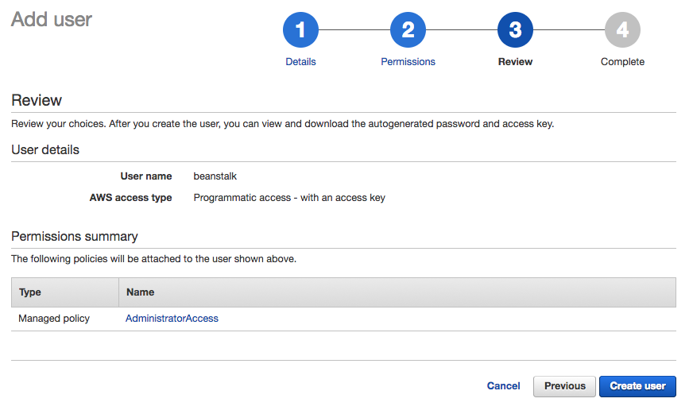

## 1. Create an SSH Key

First, you'll need to select a region. For this lab, you will need to choose either Ohio or Oregon. At the top right hand corner of the AWS Console, you'll see a Support dropdown. To the left of that is the region selection dropdown.

Go to the EC2 Dashboard and click on Key Pairs in the left menu under Network & Security. Click Create Key Pair, provide a name (can be anything, make it something memorable) when prompted, and click Create. Once created, the private key in the form of .pem file will be automatically downloaded.

&nbsp;


&nbsp;

## 2. Make the SSH key file ready to use

If you're using linux or mac, change the permissions of the .pem file to be less open.

```
$ chmod 400 <your key name>.PEM
```

Note that one Unix machines you should also place the key file at the location `~/.ssh`.

If you're on windows you'll need to download an SSH tool such as [PuTTY](http://www.putty.org/), and convert the .pem file to .ppk to work with putty. Here is a link to instructions for the file conversion - [Connecting to Your Linux Instance from Windows Using PuTTY](http://docs.aws.amazon.com/AWSEC2/latest/UserGuide/putty.html)


&nbsp;


&nbsp;

## 3. Start a development machine

1. Deploy the CloudFormation stack in this folder
2. Check the Outputs tab of the CloudFormation stack to find the IP address of the development machine

SSH into the development machine:

```
ssh -i ~/.ssh/<your key name>.pem ec2-user@<your development instance ip>
```


&nbsp;


&nbsp;


## 4. Install Development Tools

Run the following commands on your development machine to setup the development tools needed to run this workshop:

```
sudo yum install -y git
curl -O https://bootstrap.pypa.io/get-pip.py
python get-pip.py --user
pip install awscli --upgrade --user
curl -L https://git.io/n-install | bash -s -- -y 6.11.1 && . ~/.bashrc
node -e "console.log('Running Node.js ' + process.version)"
```


&nbsp;


&nbsp;

## 5. Create an IAM user on your account

Navigate to the [list of IAM users on your AWS account](https://console.aws.amazon.com/iam/home#/users)


Click the "Add User" button and fill out the two fields as indicated then click "Next"


&nbsp;

&nbsp;


## 6. Attach permissions to the IAM user

Select "Attach existing policies directly" tab, then select the "AdministratorAccess" policy. Finally click "Next".


Ensure that the settings on your review page match the image below, then click "Create User".



&nbsp;

&nbsp;

## 7. Save credentials for your new user

Click the "Download .csv" button to save the credentials for this user for future use.


