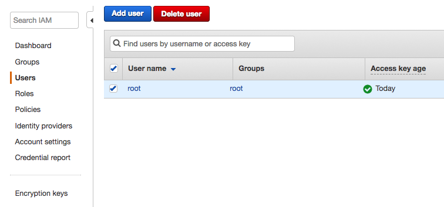
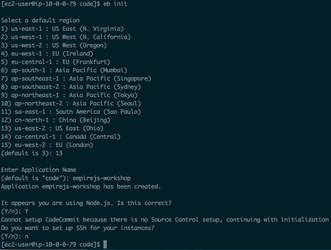

## Create IAM User for Elastic Beanstalk

1. Navigate to the [list of IAM users on your AWS account](https://console.aws.amazon.com/iam/home#/users)



2. Click the "Add User" button and fill out the two fields as indicated then click "Next"


3. Attach permissions to the user by selecting "Attach existing policies directly" and selecting the "AdministratorAccess" policy, then click "Next"


4. Review the settings to ensure that they match, then click "Create User"


5. Click the "Download .csv" button to save the credentials for this user for future use.


## Setup Elastic Beanstalk on the development instance

If you don't already have an SSH shell open on the development instance open one now:

1. Clone the workshop repository and navigate to folder containing the code:

```
cd ~
git clone https://github.com/nathanpeck/empirejs-workshop-nodejs-aws.git
cd empirejs-workshop-nodejs-aws/2\ -\ Elastic\ Beanstalk/code
```

2. Install the Elastic Beanstalk command line tool

```
pip install awsebcli --upgrade --user
```

3. Initialize an Elastic Beanstalk application in the code directory:

```
eb init
```

This will start a command line wizard that asks questions about how you want to setup your application.

Complete the wizard as shown below:



4. Create an environment for your application:

```
eb create
```

This will start a command line wizard that asks you a few questions about the environment. We will use the default name, and choose the "Network" load balancer type:


Note that it will take a few minutes to launch your first environment, since this is creating all the initial resources that are required. Once the environment is created future updates are faster.

