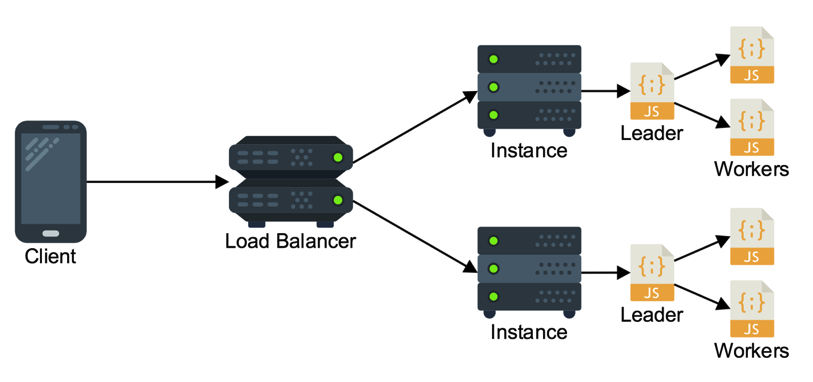
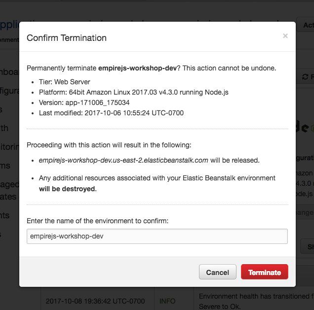
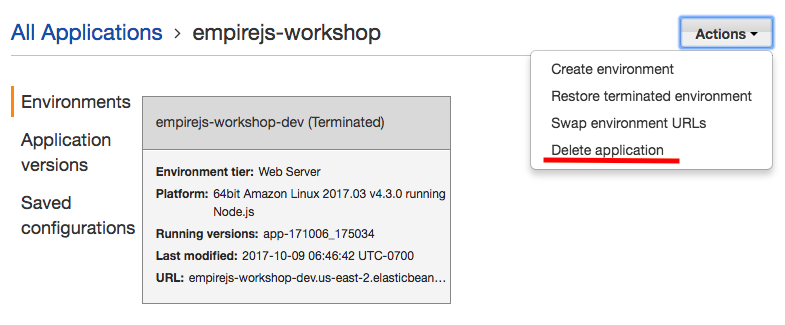

# Node.js deployed on AWS using Elastic Beanstalk



In this workshop we will deploy a monolithic Node.js application that
runs on two EC2 hosts. A load balancer will sit in front of the two hosts
to distribute traffic across them. The deployment will be orchestrated
by Elastic Beanstalk.

&nbsp;

&nbsp;

## 1. SSH into the development instance

If you have not done so already create [a development machine on AWS](../1%20-%20Development%20Environment) to do this
workshop.

If you don't already have an SSH session open, SSH to your development machine.

```
ssh -i ~/.ssh/<your key>.pem ec2-user@<your dev machine ip address>
```

If you haven't already done so clone the workshop code onto the dev machine:

```
cd ~
git clone https://github.com/nathanpeck/nodejs-aws-workshop.git
```

Then change your current working directory to the right directory for this section of the workshop:

```
cd ~/nodejs-aws-workshop/2\ -\ Elastic\ Beanstalk/code
```

&nbsp;

&nbsp;

## 2. Install the Elastic Beanstalk command line tool

Now we will use Python PIP to install the Elastic Beanstalk command line tool. This tool will give us a command line wizard that will help detect details of our project, and automatically deploy it on AWS:

```
pip install awsebcli --upgrade --user
```

&nbsp;

&nbsp;

## 3. Initialize an Elastic Beanstalk application in the code directory:

Use the following command to start a new Elastic Beanstalk application in the code directory:

```
eb init
```

This will launch a command line wizard that asks questions about how you want to setup your application.

Complete the wizard as shown below:


The command line tool will automatically detect that this is a Node.js application. Note that for consistency please make sure you choose the "us-east-1" region for deployment. At the time of writing this workshop "us-east-1" is #13 in the menu.

&nbsp;

&nbsp;

## 4. Launch an environment for your application:

Use the following command to launch the application your initialized on your account:

```
eb create
```

This will start a command line wizard that asks you a few questions about the environment. You will need to enter your own name for the environment, and choose the "Network" load balancer type:


Note that it will take a few minutes to launch your first environment, since this is creating all the initial resources that are required. Once the environment is created future updates are faster.

&nbsp;

&nbsp;

## 5. Verify that your environment is up and running:

After the application completes deploying you can access your environment using the URL that is listed in the [Elastic Beanstalk console](https://us-east-1.console.aws.amazon.com/elasticbeanstalk/home?region=us-east-1#/application/overview?applicationName=nodejs-workshop):


Here is an example of using curl to fetch a list of users from the API:

```
curl http://nodejs-workshop-dev.us-east-1.elasticbeanstalk.com/api/characters
```

Or you can just enter the URL into your browser to check it:


&nbsp;

&nbsp;

## 6. Deploy a new version of the application:

You can make any changes that you want to the application, and then roll them out using the following command:

```
eb deploy
```

Note that for any code changes to be reflected when the project being deployed is a Git repo the changes must be committed to the repo, because Elastic Beanstalk always deploys the most recent commit, never uncomitted changes.

&nbsp;

&nbsp;

## 7. Shutdown the application

Whe you are done experimenting with Elastic Beanstalk you can shutdown your application. First choose "Terminate Application" from the action menu on your environment:


In the popup dialog enter the environment name to confirm that you really want to delete it, and click "Terminate"



It will take a few minutes for the environment to be cleaned up. You will see events for the environment that indicate that it is being destroyed:


Once you see "terminateEnvironment completed successfully" you can delete the application itself, by using the Action menu on the application:



