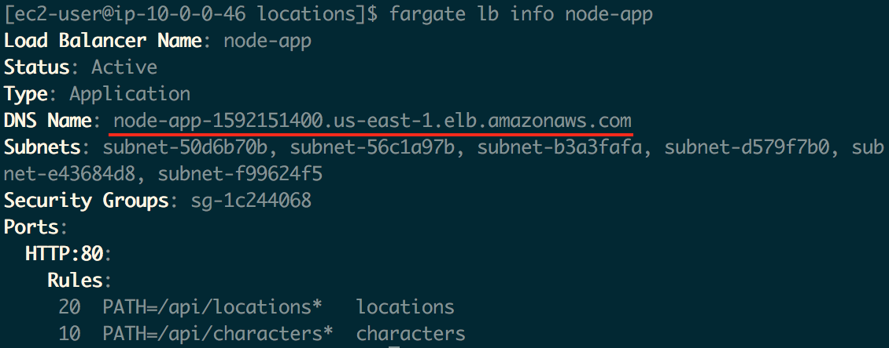

## 1. Connect to your development machine

If you don't already have an SSH session open, SSH to your development machine.

```
ssh -i ~/.ssh/<your key>.pem ec2-user@<your dev machine ip address>
```

If you haven't already done so clone the workshop code onto the dev machine:

```
cd ~
git clone https://github.com/nathanpeck/nodejs-aws-workshop.git
```

Then change your current working directory to the right directory for this section of the workshop:

```
cd ~/nodejs-aws-workshop/5\ -\ AWS\ Fargate/code
```

&nbsp;

&nbsp;

## 2. Install the Fargate CLI tool:

For this workshop we will be using a command line tool by @jpignata called [fargate](http://somanymachines.com/fargate/)

```
curl -OL https://github.com/jpignata/fargate/releases/download/v0.2.1/fargate-0.2.1-linux-amd64.zip | unzip
sudo unzip fargate-0.2.1-linux-amd64.zip -d /usr/local/bin
```

## 3. Create a load balancer for your AWS Fargate deployment

```
fargate lb create node-app --port 80
```

## 4. Build and deploy

```
cd characters
fargate service create characters --lb node-app --port 80 --rule PATH=/api/characters*
cd ../locations
fargate service create locations --lb node-app --port 80 --rule PATH=/api/locations*
```

## 5. Fetch load balancer info

Now lets fetch the info of the load balancer to make sure that it is configured correctly and to get the DNS name of the load balancer:

```
fargate lb info node-app
```

You will see output similar to this: 



## 6. Test the API

Using the DNS name from the load balancer make a request to the API as deployed in Fargate. For example:

```
curl node-app-1592151400.us-east-1.elb.amazonaws.com/api/characters
curl node-app-1592151400.us-east-1.elb.amazonaws.com/api/locations
```

## 7. Scale a service

Right now the two Fargate services are deployed as single containers. With the Fargate CLI you can easily scale these services to deploy more copies of the containers behind the load balancer.

```
fargate service scale characters +2
```

## 8. Update a service

You can redeploy a service by making a change to its code and then using the following command:

```
fargate servie update characters
```

## 9. Shut down the Fargate services

Scale the Fargate services down to zero containers:

```
fargate service scale characters 0
fargate service scale locations 0
```

Once the services have finished scaling down destroy them:

```
fargate service destroy characters
fargate service destroy locations
```

Get rid of the load balancer that you created:

```
fargate lb destroy node-app
```

Go to the [repositories tab on the ECS dashboard](https://us-east-1.console.aws.amazon.com/ecs/home?region=us-east-1#/repositories), and select the "characters" and "locations" repositories, and click "Delete Repository"


Last but not least if you are done with this workshop don't forget to also delete the cloudformation stack "nodejs-dev-machine", to destroy the development machine you used throughout this workshop.
